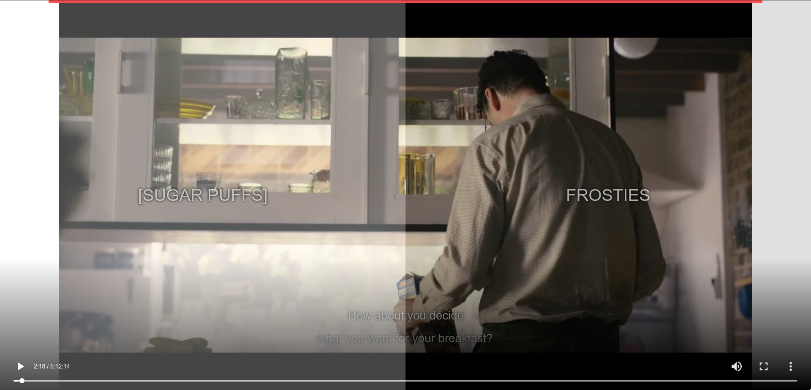

# Bandersnatch Interactive Player (based on html5 video player)
With this online(html) video player you can watch `Bandersnatch` episode of `Black Mirror` **interactively**. 

[Live demo](https://mehotkhan.github.io/BandersnatchInteractive/)

## How to use
The only thing you need is 5hours video file of `Bandersnatch` episode, Drag & drop the file in [this](https://mehotkhan.github.io/BandersnatchInteractive/) page and enjoy!

## Screenshot

  
## Tips

* Only work on google chrome (Doesn't work on Firefox; codec problems)
* Download `Bandersnatch` video file (`5:12:14`)
* Drag it on white box on [page](https://mehotkhan.github.io/BandersnatchInteractive/) :)
* On full screen video choice don't show !!!
* Only english subtitle available, If you want add another language subtitle, tell me.
* if you dont choose any item , right item selected
## Controls

* <kbd>F</kbd> - Toggle fullscreen
* <kbd>R</kbd> - Restart video
* <kbd>→</kbd> - Jump to the next segment (or to the next interaction zone)
* <kbd>←</kbd> - Jump to the previous segment
* <kbd>Space</kbd> - Toggle play and pause
  
## Persian user
* if you are persian user , read this : [پلیر تعاملی ( اینتراکتیو )‌ برای قسمت جدید بلک میرور]( http://vrgl.ir/YzhCn )

## Credit
* based on [joric work](https://github.com/joric/bandersnatch)
